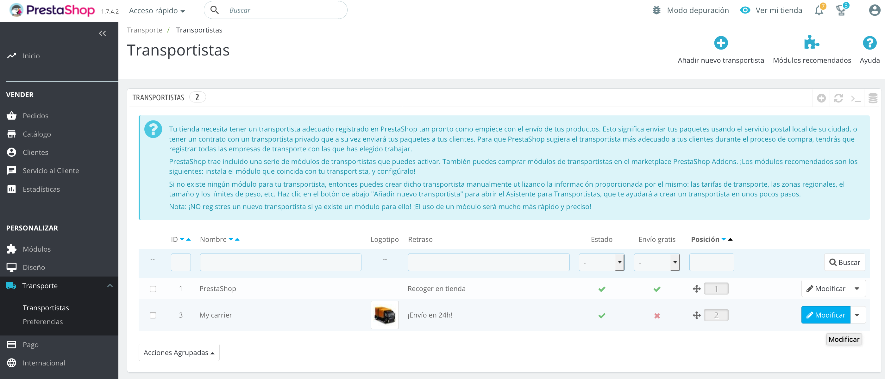
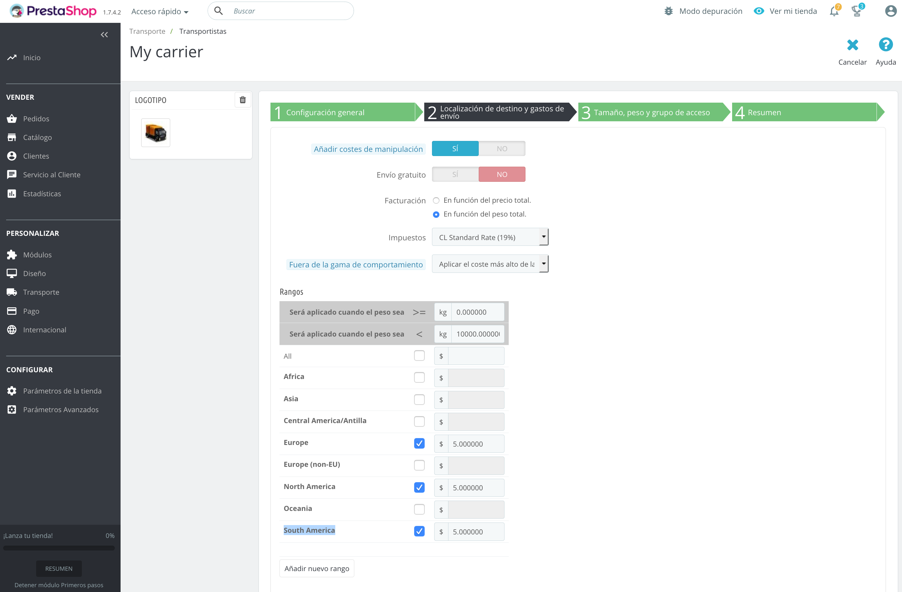

#  Prestashop Docker para desarrollo

### PHP 8.0 + Mariadb + Prestashop 8.0.3

### Requerimientos

**MacOS:**

Instalar [Docker](https://docs.docker.com/docker-for-mac/install/), [Docker-compose](https://docs.docker.com/compose/install/#install-compose) y [Docker-sync](https://docker-sync.readthedocs.io/en/latest/).

**Windows:**

Instalar [Docker](https://docs.docker.com/docker-for-windows/install/), [Docker-compose](https://docs.docker.com/compose/install/#install-compose) y [Docker-sync](https://docker-sync.readthedocs.io/en/latest/).

**Linux:**

Instalar [Docker](https://docs.docker.com/engine/installation/linux/docker-ce/ubuntu/) y [Docker-compose](https://docs.docker.com/compose/install/#install-compose).

### Bajar dependencias del proyecto (en la carpeta Webpay)

```
cd ..
composer install && composer update
```

### Como usar

De forma automática se creará una imagen Prestashop, se creará un producto de ejemplo.

Para instalar Prestashop, hacer lo siguiente:

```
cd docker-prestashop-php8.0-pres8.0.3-apache
docker compose up
```

Para instalra el plugin comprimir la carpeta webpay en zip y subir como plugin

### Paneles

**Web server:** http://localhost:8080

**Admin:** http://localhost:8080/adminop

    user: admin@admin.com
    password: password


### Importante

Debes configurar el transportista en (Transporte / Transportistas) modificando "My carrier" para enviar a "South America", ejemplo agregando un costo de $5.




