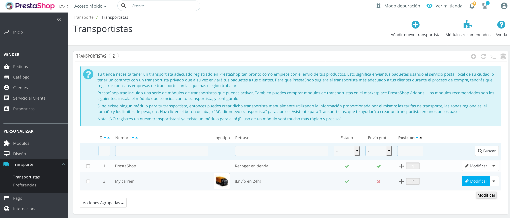

#  Prestashop Docker para desarrollo

### PHP 5.6 + Mysql + Prestashop 1.6

### Requerimientos

**MacOS:**

Instalar [Docker](https://docs.docker.com/docker-for-mac/install/), [Docker-compose](https://docs.docker.com/compose/install/#install-compose) y [Docker-sync](https://github.com/EugenMayer/docker-sync/wiki/docker-sync-on-OSX).

**Windows:**

Instalar [Docker](https://docs.docker.com/docker-for-windows/install/), [Docker-compose](https://docs.docker.com/compose/install/#install-compose) y [Docker-sync](https://github.com/EugenMayer/docker-sync/wiki/docker-sync-on-Windows).

**Linux:**

Instalar [Docker](https://docs.docker.com/engine/installation/linux/docker-ce/ubuntu/) y [Docker-compose](https://docs.docker.com/compose/install/#install-compose).

### Bajar dependencias del proyecto

```
cd ..
composer install && composer update
```

### Como usar

De forma automática se creará una imagen Prestashop, se creará un producto de ejemplo y finalmente se activará este plugin.

Para instalar Prestashop, hacer lo siguiente:

**NOTA:** La primera vez que se ejecuta ./start o ./build demorará en instalar todo, esperar al menos unos 5 minutos.

### Construir el contenedor desde cero

```
./build
```

### Iniciar el contenedor construido anteriormente

```
./start
```

### Acceder al contenedor

```
./shell
```

### Logs

```
tail -f /var/www/html/var/logs/Transbank_webpay/log_transbank_prestashop_*.log
```

### Paneles

**Web server:** http://localhost:8080

**Admin:** http://localhost:8080/adminop

    user: admin@admin.com
    password: password


### Importante

Debes configurar el transportista en (Transporte / Transportistas) modificando "My carrier" para enviar a "South America", ejemplo agregando un costo de $5.




