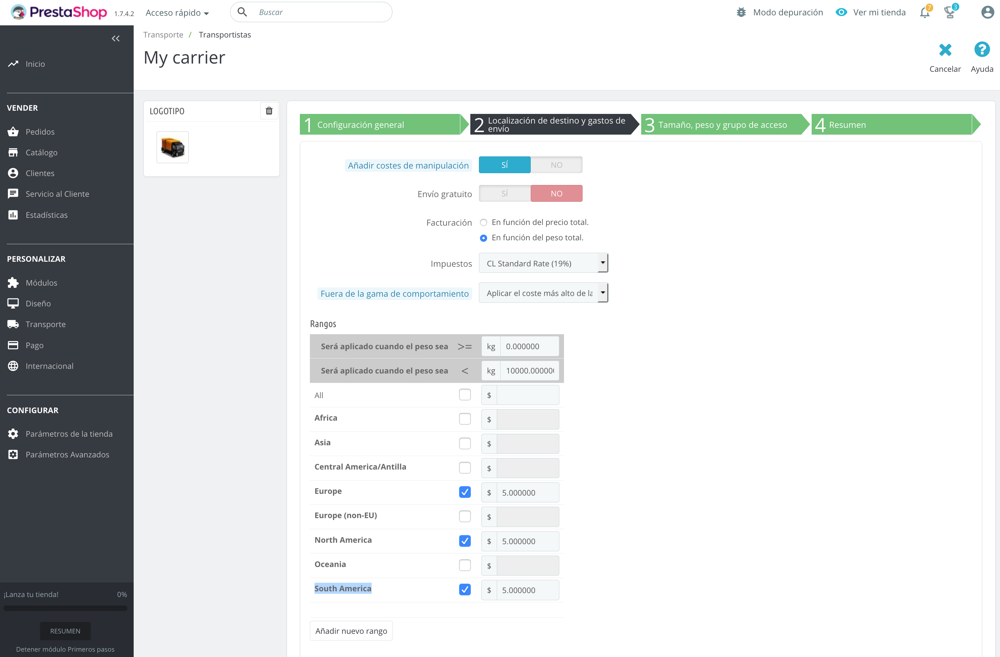

# PrestaShop 1.7.8.11 + PHP 7.4 + Mariadb

## Requerimientos

### **MacOS:**

Instalar [Docker](https://docs.docker.com/docker-for-mac/install/), [Docker-compose](https://docs.docker.com/compose/install/#install-compose) y [Docker-sync](https://docker-sync.readthedocs.io/en/latest/).

### **Windows:**

Instalar [Docker](https://docs.docker.com/docker-for-windows/install/), [Docker-compose](https://docs.docker.com/compose/install/#install-compose) y [Docker-sync](https://docker-sync.readthedocs.io/en/latest/).

### **Linux:**

Instalar [Docker](https://docs.docker.com/engine/installation/linux/docker-ce/ubuntu/) y [Docker-compose](https://docs.docker.com/compose/install/#install-compose).

## Instalar dependencias del modulo (en la carpeta Webpay)

Desde la carpeta Webpay, ejecutar el comando para instalar las dependencias.

```bash
cd ../../ # En caso de estar dentro de la carpeta del contenedor.
composer install && composer update
```

## Como usar

El contenedor expondrá una instancia de PrestaShop y una base de datos. Dejara activo de forma automática el modulo de Webpay.

Para correr la imagen de docker se debe ejecutar el siguiente comando:

```bash
cd docker/docker-prestashop-php7.4-pres1.7.8.11-apache
docker compose up
```

## Accesos

### PrestaShop

PrestaShop quedara disponible en el puerto 8080. Las URL son las siguientes:

**Tienda:** http://localhost:8080

**Panel de administración:** http://localhost:8080/adminop

Las credenciales son:

    Usuario: admin@admin.com
    Contraseña: password


## Importante

Para poder realizar una venta, debes configurar el transportista en la sección `Transporte/Transportistas`. Desde ahí debes modificar alguno de los transportistas disponibles como "My carrier" o "PrestaShop" y habilitar la localización de destino para enviar a "South America". Puedes agregar un costo de envío, por ejemplo $5.

### Capturas



