# Manual de instalación para Plugin Prestashop

## Descripción

Este plugin oficial ha sido creado para que puedas integrar Webpay fácilmente en tu comercio, basado en Prestashop.

## Requisitos

Debes tener instalado previamente Prestashop.

Habilitar los siguientes módulos / extensiones para PHP:

- JSON
- Soap
- OpenSSL 1.0.1 o superior
- SimpleXML
- DOM 2.7.8 o superior

## Instalación de Plugin

1. Dirígete a [https://github.com/TransbankDevelopers/transbank-plugin-prestashop-webpay-rest/releases/latest](https://github.com/TransbankDevelopers/transbank-plugin-prestashop-webpay-rest/releases/latest), y descarga la última versión disponible del plugin.

Una vez descargado el plugin, ingresa a la página de administración de Prestashop
(usualmente en _misitio.com_/admin), y dirígete a Módulos > Gestor de módulo (o Module Manager),
como se indica a continuación:

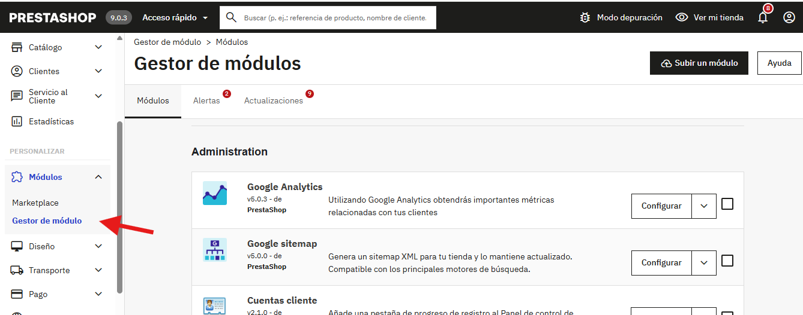

2. Haz click sobre el botón "Subir un módulo":

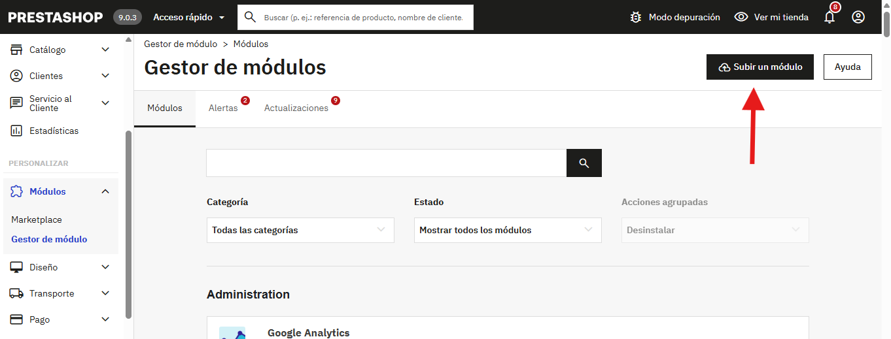

3. Se abrirá un cuadro para subir el módulo descargado previamente. Procede a arrastrar
   el archivo, o haz click en "selecciona el archivo" y selecciónalo desde tu computador:

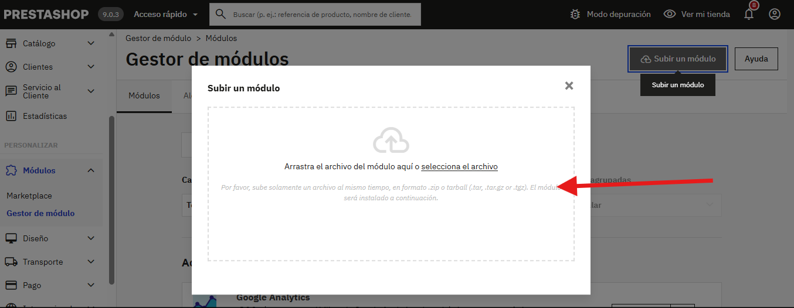

4. Prestashop procederá a instalar el módulo. Una vez finalizado, se te indicará que
   el módulo fue instalado, y cuando esto suceda debes hacer click en el botón "Configurar":

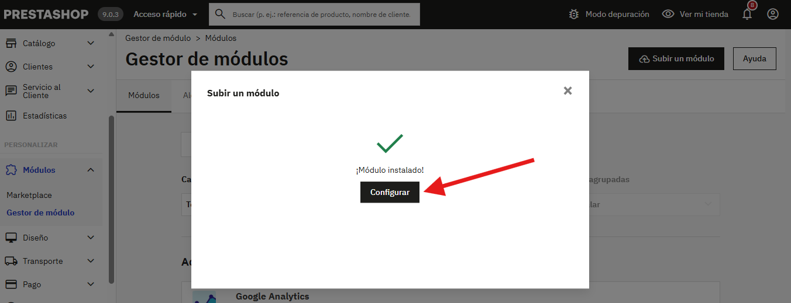

5. Después de instalar el módulo, es obligatorio volver a iniciar sesión para actualizar los permisos del usuario administrador actualmente autenticado.

## Configuración

Este plugin posee un sitio de configuración que te permitirá ingresar credenciales
que Transbank te otorgará.

Para acceder a la configuración, debes seguir los siguientes pasos:

1. Dirígete a la página de administración de Prestashop (usualmente en _misitio.com_/admin),
   y luego anda a Módulos > Gestor de módulo (ó Module Manager).

2. Busca "Webpay", y presiona el botón "Configurar":

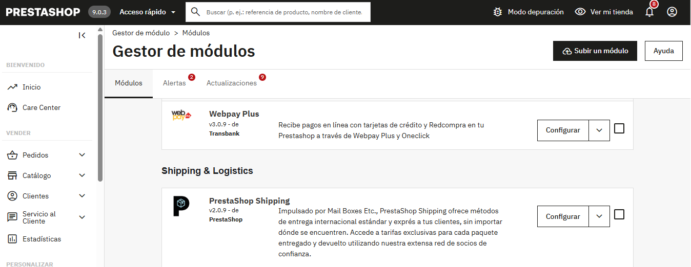

3. ¡Ya está! Estás en la pantalla de configuración del plugin, debes ingresar la siguiente información:

- **Producción**: Selector de ambiente donde se procesarán las transacciones. Por defecto viene desactivado, utilizando el ambiente de integración. Una vez aprobada el proceso de validación, podrás activarlo para operar en producción. Más info sobre los
  ambientes y el proceso de validación
  [acá](https://transbankdevelopers.cl/documentacion/como_empezar#el-proceso-de-validacion)
- **Código de comercio**: Es lo que te identifica como comercio. Para el ambiente de integración
  siempre es `597055555532`. Para operar en producción debes colocar el tuyo.
- **API Key (llave secreta)**: Llave secreta que te autoriza y valida a hacer transacciones.
  No la compartas con nadie.

- **Estado Pago Aceptado**: Permite seleccionar el estado que se asignará automáticamente al pedido cuando una transacción sea aprobada y confirmada correctamente. Las opciones disponibles son Pago aceptado o Preparación en curso.

Las opciones disponibles para _Producción_ son: "Apagado" para realizar pruebas y certificar la instalación con Transbank, y "Encendido" para hacer transacciones reales una vez que Transbank ha aprobado el comercio.

### Credenciales de Prueba

Para el ambiente de Integración, puedes utilizar las siguientes credenciales para realizar pruebas:

- Código de comercio: `597055555532`
- Llave secreta: `579B532A7440BB0C9079DED94D31EA1615BACEB56610332264630D42D0A36B1C`

Puedes encontrar esta información siempre actualizada en [la documentación](https://transbankdevelopers.cl/documentacion/como_empezar#codigos-de-comercio)

1. Guardar los cambios presionando el botón [SAVE]

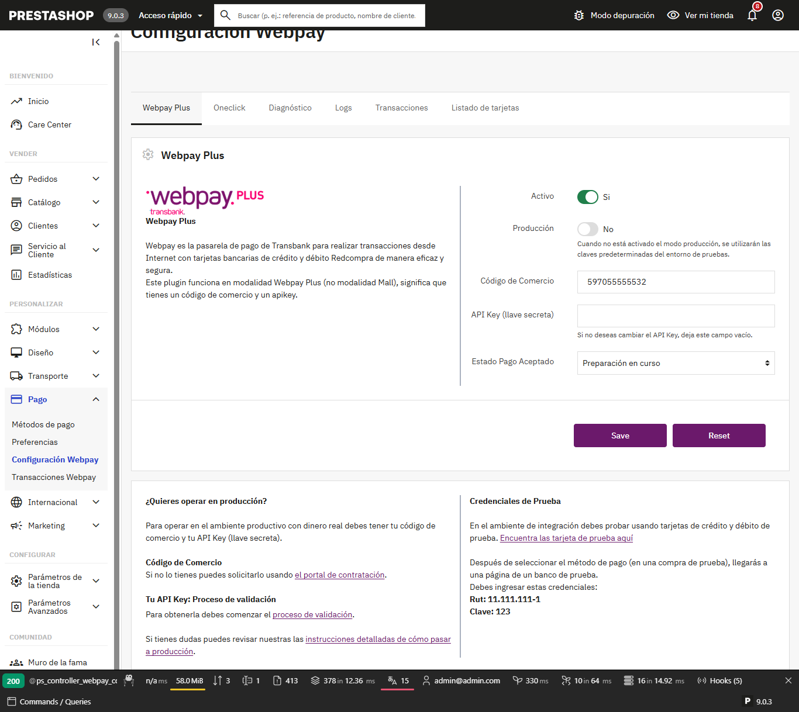

## Prueba de instalación con transacción

En ambiente de integración es posible realizar una prueba de transacción utilizando un emulador de pagos online.

- Ingresa al comercio

    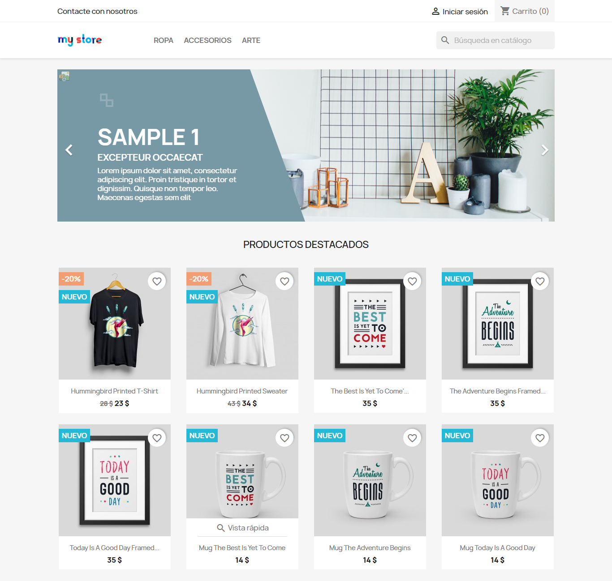

- Ya con la sesión iniciada, ingresa a cualquier sección para agregar productos

    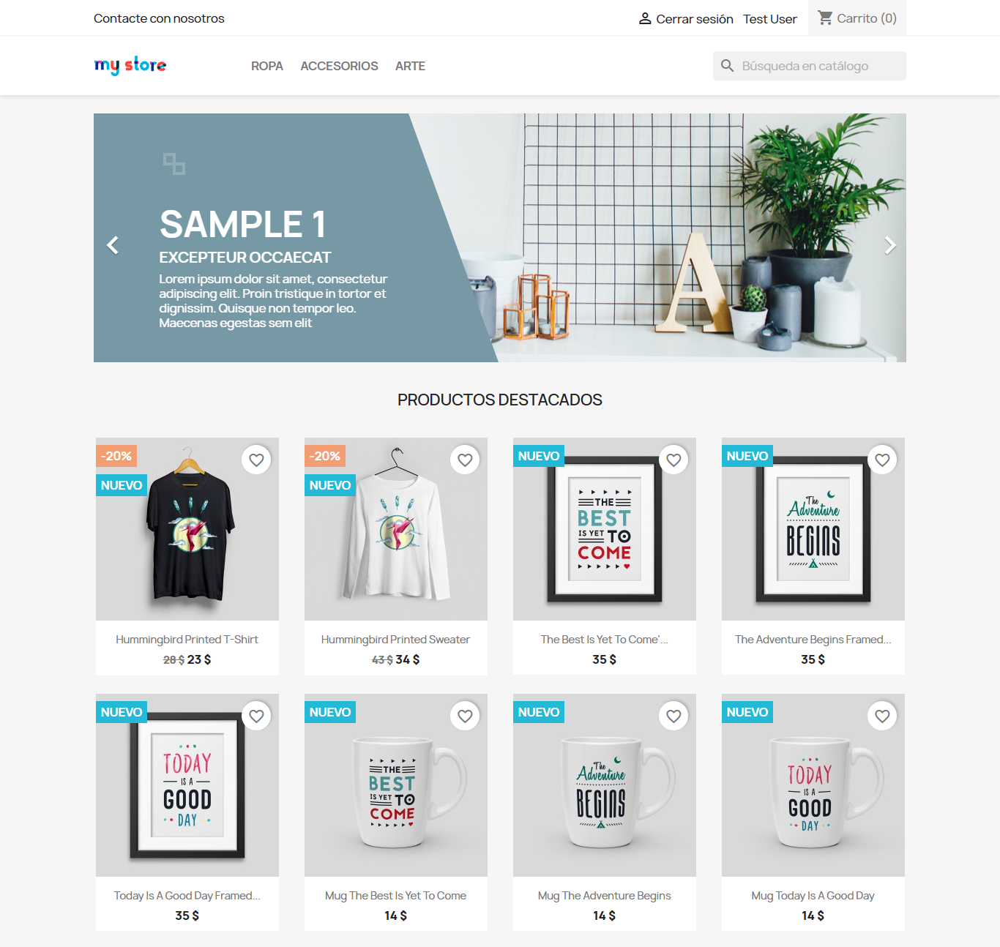

- Agrega al carro de compras un producto, selecciona el carro de compras y luego presiona el botón [FINALIZAR COMPRA]:

    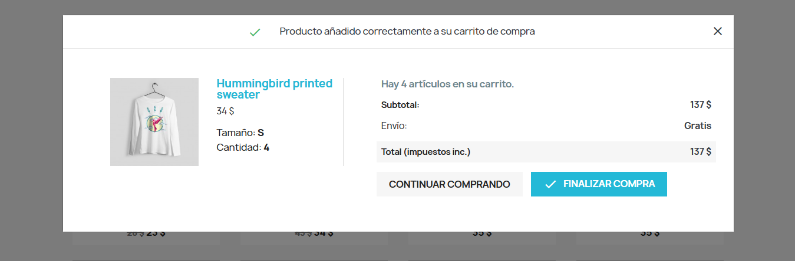

- Presiona el botón [FINALIZAR COMPRA]:

    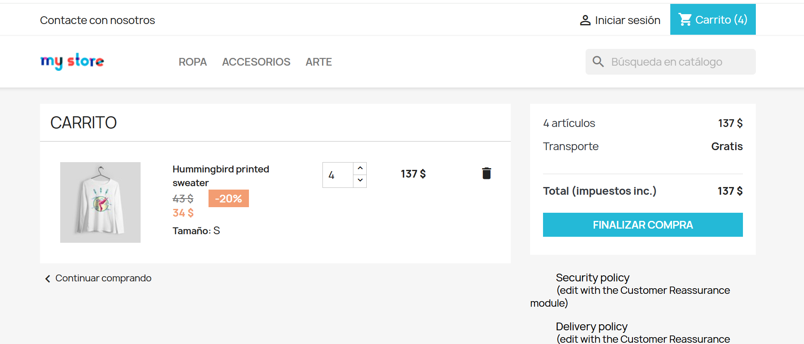

- Selecciona método de envío y presiona el botón [CONTINUAR]

    Debes asegurarte que tu dirección de envio sea en Chile.

    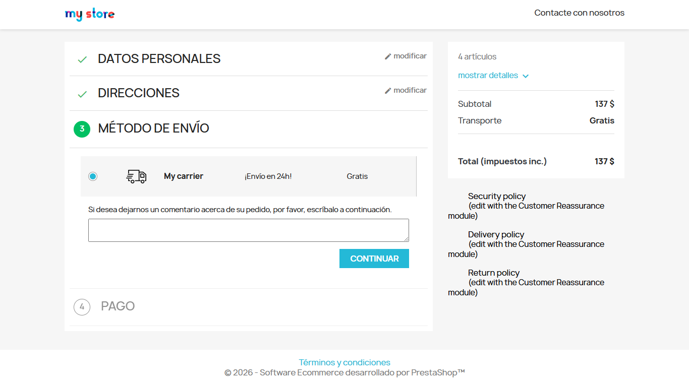

- Selecciona método de pago con tarjetas de crédito, débito y prepago a través de Webpay Plus, selecciona los "términos de servicio" y
  luego presiona el botón [REALIZAR PEDIDO]

    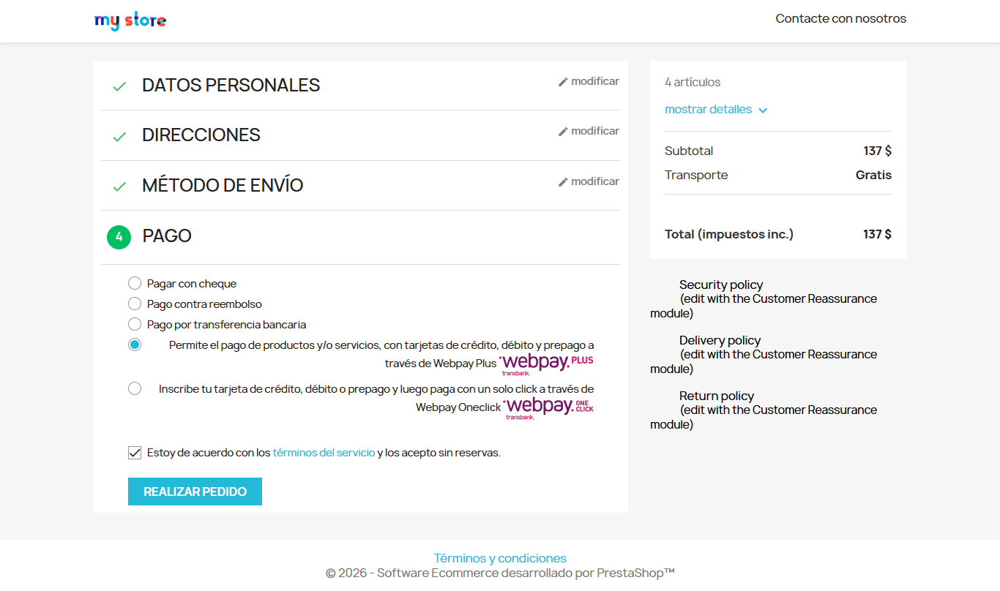

- Una vez presionado el botón para iniciar la compra, se mostrará la ventana de pago Webpay y deberás seguir el proceso de pago.

Para pruebas puedes usar los siguientes datos:

- Número de tarjeta: `4051885600446623`
- Rut: `11.111.111-1`
- Cvv: `123`

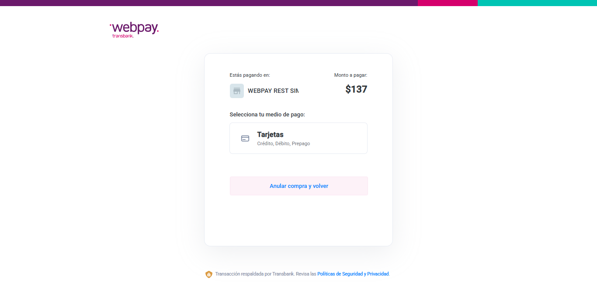

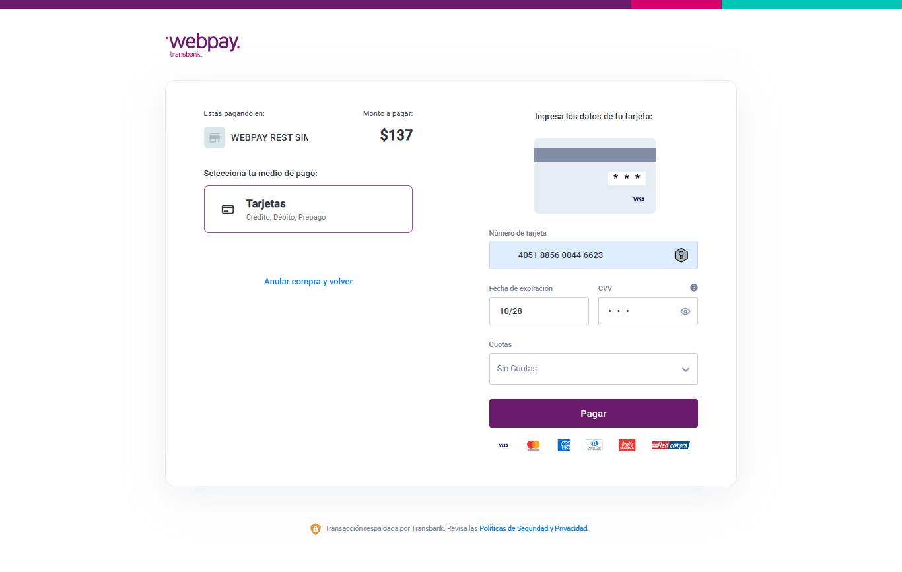

Para pruebas puedes usar los siguientes datos:

- Rut: `11.111.111-1`
- Clave: `123`

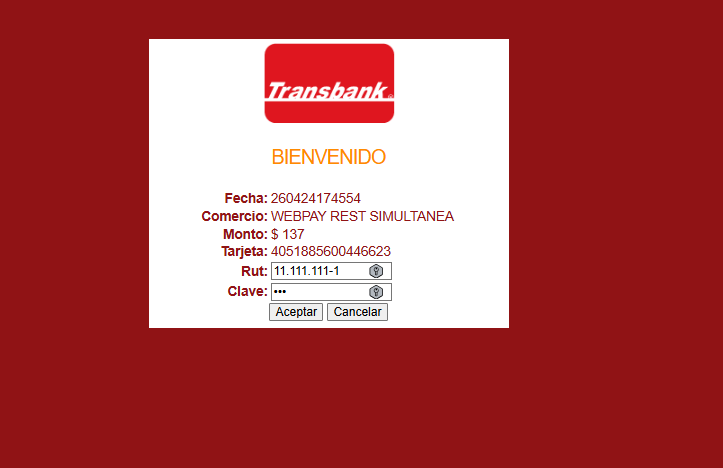

Puedes aceptar o rechazar la transacción

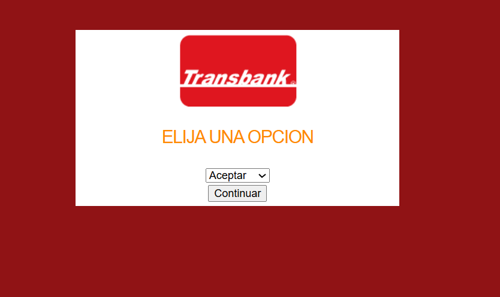

- Serás redirigido a Prestashop y podrás comprobar que el pago ha sido exitoso.

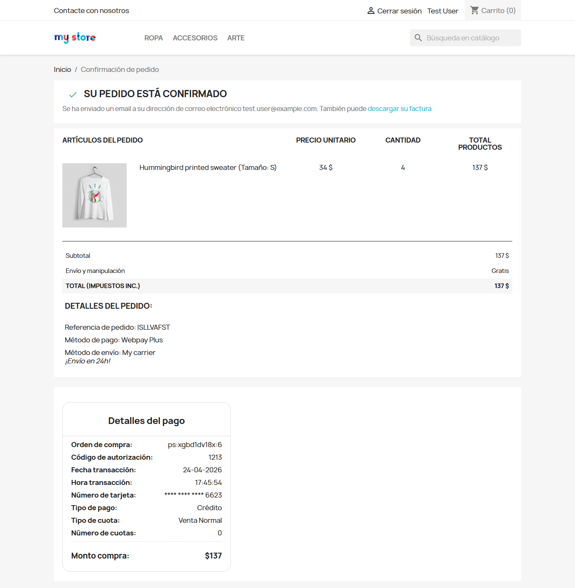

- Además si accedes al sitio de administración sección (Pedidos / Pediso) se podrá ver la orden creada y el detalle de los datos entregados por Webpay.

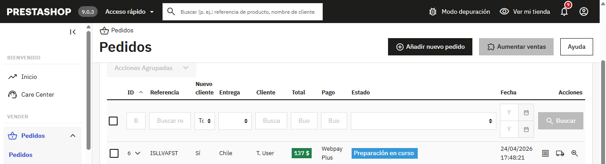

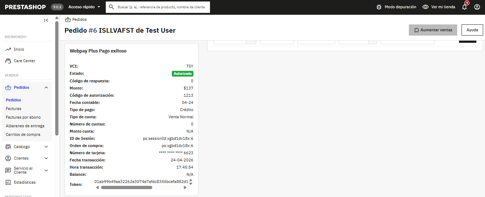
