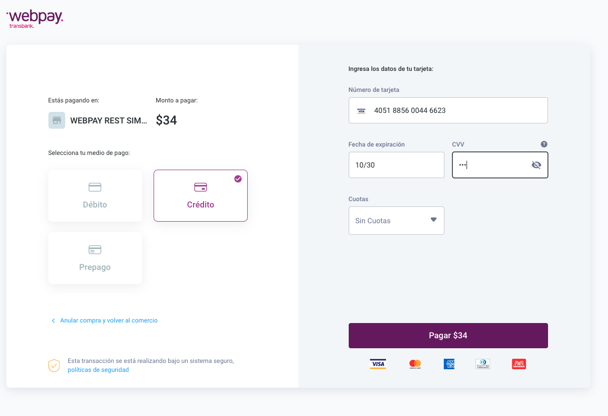

# Manual de instalación para Plugin Prestashop

## Descripción

Este plugin oficial ha sido creado para que puedas integrar Webpay fácilmente en tu comercio, basado en Prestashop.

## Requisitos

Debes tener instalado previamente Prestashop.

Habilitar los siguientes módulos / extensiones para PHP:
- Soap
- OpenSSL 1.0.1 o superior
- SimpleXML
- DOM 2.7.8 o superior

## Instalación de Plugin

1. Dirígete a [https://github.com/TransbankDevelopers/transbank-plugin-prestashop-webpay-rest/releases/latest](https://github.com/TransbankDevelopers/transbank-plugin-prestashop-webpay-rest/releases/latest), y descarga la última versión disponible del plugin.

  Una vez descargado el plugin, ingresa a la página de administración de Prestashop 
  (usualmente en _misitio.com_/admin), y dirígete a Módulos > Módulos y Servicios (o Module Manager), 
  como se indica a continuación:

  
  
2. Haz click sobre el botón "Subir un módulo":

  
  
3. Se abrirá un cuadro para subir el módulo descargado previamente. Procede a arrastrar 
el archivo, o haz click en "selecciona el archivo" y selecciónalo desde tu computador:

  

4. Prestashop procederá a instalar el módulo. Una vez finalizado, se te indicará que 
el módulo fue instalado, y cuando esto suceda debes hacer click en el botón "Configurar":

  

## Configuración

Este plugin posee un sitio de configuración que te permitirá ingresar credenciales 
que Transbank te otorgará, y además podrás generar un documento de diagnóstico en caso que 
Transbank te lo pida.

Para acceder a la configuración, debes seguir los siguientes pasos:

1. Dirígete a la página de administración de Prestashop (usualmente en _misitio.com_/admin),
 y luego anda a Módulos > Módulos y Servicios (ó Module Manager).

  

2. Busca "Webpay", y presiona el botón "Configurar":

  

3. ¡Ya está! Estás en la pantalla de configuración del plugin, debes ingresar la siguiente información:

  * **Ambiente**: Ambiente hacia donde se realiza la transacción. Viene configurado para el ambiente de 
  integración, pero una vez que pases la validación podrás cambiarlo a producción. Más info sobre los 
  ambientes y el proceso de validación 
  [acá](https://transbankdevelopers.cl/documentacion/como_empezar#el-proceso-de-validacion) 
  * **Código de comercio**: Es lo que te identifica como comercio. Para el ambiente de integración 
  siempre es `597055555532`. Para operar en producción debes colocar el tuyo. 
  * **API Key (llave secreta)**: Llave secreta que te autoriza y valida a hacer transacciones. 
  No la compartas con nadie. 
  
  Las opciones disponibles para _Ambiente_ son: "Integración" para realizar pruebas y certificar la instalación con Transbank, y "Producción" para hacer transacciones reales una vez que Transbank ha aprobado el comercio.
  
### Credenciales de Prueba

Para el ambiente de Integración, puedes utilizar las siguientes credenciales para realizar pruebas:

* Código de comercio: `597055555532`
* Llave secreta: `579B532A7440BB0C9079DED94D31EA1615BACEB56610332264630D42D0A36B1C`

Puedes encontrar esta información siempre actualizada en [la documentación](https://transbankdevelopers.cl/documentacion/como_empezar#codigos-de-comercio)

1. Guardar los cambios presionando el botón [Guardar]

2. Además, puedes generar un documento de diagnóstico en caso que Transbank te lo pida. Para ello, haz click en el botón "Información" ahí podrás descargar un pdf.

  

  

## Prueba de instalación con transacción

En ambiente de integración es posible realizar una prueba de transacción utilizando un emulador de pagos online.

* Ingresa al comercio

  

* Ya con la sesión iniciada, ingresa a cualquier sección para agregar productos

  

* Agrega al carro de compras un producto, selecciona el carro de compras y luego presiona el botón [Pasar por caja]:

  

* Presiona el botón [Pasar por caja]:

  

* Selecciona método de envío y presiona el botón [Continuar]
  
  Debes asegurarte que tu dirección de envio sea en Chile.

  

* Selecciona método de pago con tarjetas de crédito o Redcompra, selecciona los "términos de servicio" y
 luego presiona el botón [Pedido con obligación de pago]

  

* Una vez presionado el botón para iniciar la compra, se mostrará la ventana de pago Webpay y deberás seguir el proceso de pago.

Para pruebas puedes usar los siguientes datos:  

* Número de tarjeta: `4051885600446623`
* Rut: `11.111.111-1`
* Cvv: `123`
  

Para pruebas puedes usar los siguientes datos:  

* Rut: `11.111.111-1`
* Clave: `123`

Puedes aceptar o rechazar la transacción

  
* Serás redirigido a Prestashop y podrás comprobar que el pago ha sido exitoso.

 

* Además si accedes al sitio de administración sección (Pedidos / Pediso) se podrá ver la orden creada y el detalle de los datos entregados por Webpay.

 

 
